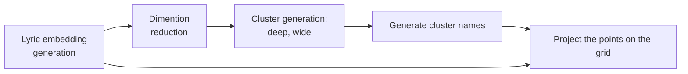
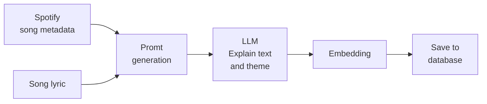
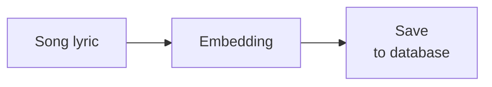

# Lyric & Emotion clusterization
## Top-level view

## Steps
### Lyric embedding generation
#### First approach

#### Second approach

### Dimension reduction
Firstly, using UMAP algorithm we reduce dimensions of the embeddings.
As in [https://habr.com/ru/articles/992910/], we use parameters, like:
- _Source dimensions_ = 1536
- _Target dimensions_ = 15
- _Neighbors_ = 30
- _Metric_ = 'cosine'
- _Cluster density_ = 0

Secondly, the cluster detection algorithm HDBSCAN is being used after applying L2-normalization.

As was mentioned before, there are several level of cauterizations. For example:
- Deep clusterization: 
	- `min_cluster_size` = 50
	- `min_samples` = 15
- Wide clusterization:
	- `min_cluster_size` = 500
	- `min_samples` = 100

Some points cannot be assigned to any existing clusters (marked as $-1$). So, these points will correspond to the "Others" group.

### Generate cluster names
ХЗ как, читай https://habr.com/ru/articles/992910/

### Project the points on the grid
We convert each embedding to 2d point $(x, y)$ using **t-SNE** algorithm